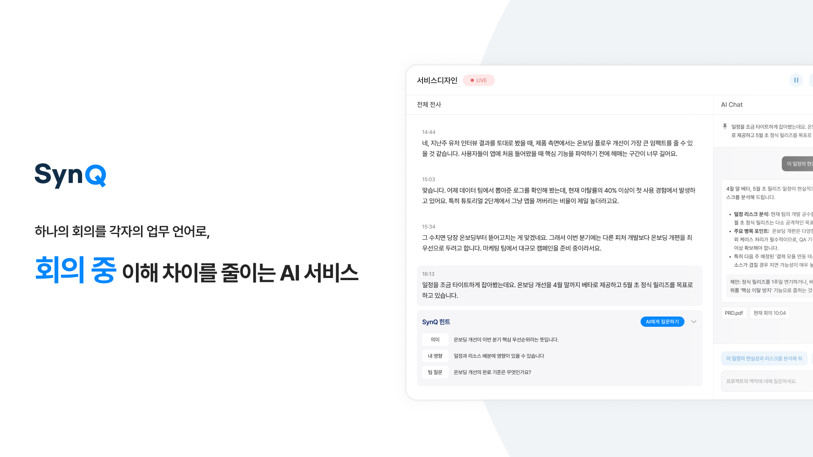

  

# SynQ

> 하나의 회의를 각자의 업무 언어로,  
> **회의 중 이해 차이를 줄이는 AI 서비스**

SynQ는 회의 중 발생하는 이해 차이를 줄이고,  
각자의 역할과 업무 맥락에 맞는 정보를 제공하는 AI 기반 협업 서비스입니다.

 

## 🔗 Links

- [SynQ Notion Workspace](https://app.notion.com/p/SynQ-Workspace-3637082bc9278086abd4efe0447cdcb9?source=copy_link)
- [SynQ Figma](https://www.figma.com/design/FHZ49MS3HLNgs6JOIv13HX/SynQ?node-id=521-246&p=f&t=SpETJwE8XOi9XsTK-0)

 

## 👥 Team Members

### PM

| Nickname / Name | Role |
|---|---|
| [미소 / 이소민](https://github.com/soming1810) | PM |

 

### Design

| Nickname / Name | Role |
|---|---|
| 동동 / 이동휘 | Design |
| 긍굥 / 윤은서 | Design |

 

### Web

| Nickname / Name | Role |
|---|---|
| [도비 / 김도현](https://github.com/rlaehgus4418) | Web Lead |
| [찰깐 / 이태건](https://github.com/chobiggun) | Web |
| [곽철용 / 곽영찬](https://github.com/asked1015) | Web |

 

### Server

| Nickname / Name | Role |
|---|---|
| [제이스 / 인석진](https://github.com/sjinssun) | Server Lead |
| [도미니 / 이민규](https://github.com/immigrationgue) | Server |
| [데이 / 한다경](https://github.com/handagyeong) | Server |
| [요한 / 문서찬](https://github.com/dev-moonsc) | Server |
| [조자 / 이중희](https://github.com/jungee123213) | Server |
| [써니 / 박서은](https://github.com/1PSE) | Server |

 

## 📁 Repositories

| Repository | Description |
|---|---|
| `frontend` | SynQ 웹 프론트엔드 |
| `backend` | SynQ 백엔드 서버 |
